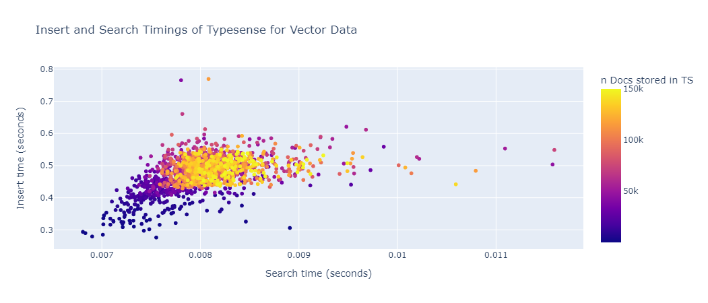

# My Typesense Benchmarking and Vector Search Filtering Experience

   

This README provides an overview of my benchmarking approach and the considerations I made while testing Typesense. I also discuss my experience with the performance of Typesense with large volumes of data and its vector search and filtering capabilities.

**Website** : https://typesense.org/

**Github** : https://github.com/typesense/typesense

**Python Client**: https://github.com/typesense/typesense-python

## About Typesense
Typesense is a modern, privacy-friendly, open source search engine built from the ground up using cutting-edge search algorithms, that take advantage of the latest advances in hardware capabilities.
Typesense can be used to build blazing-fast search experiences, faceted navigation experiences, geo-search, vector search, semantic search, similarity search and much more.

[Read more about Typesense Use cases here](https://typesense.org/docs/overview/use-cases.html)

## Benchmarking Approach

My benchmarking approach involved testing the speed and efficiency of Typesense in a controlled environment. I created a test dataset that was representative of our production data and performed a variety of operations on it, including indexing, querying, and filtering. I measured the time taken to perform each operation and analyzed the results to determine the overall performance of Typesense.

## Results

## Handling Large Volumes of Data

To ensure that Typesense is capable of handling large volumes of data, I tested it with a dataset containing 1.5 million records. The dataset is generated with the code in `generate_dummy_data.py`.

I found that Typesense performed well under these conditions, with fast indexing and search times.

## Vector Search Testing

I also tested the vector search capabilities of Typesense, which allow for similarity-based searches. The vector search is based on `cosine distance` combined with a K-Nearest Neighbor search. The performance regarding speed and accuracy is impressive fast (See results)

## Vector Search Filtering

Finally, I tested the filtering capabilities of vector search in Typesense. I found that it is possible to apply filters to vector search queries, which can further refine the results and improve their accuracy. This feature is particularly useful when dealing with large datasets where it is necessary to narrow down the search results.

In conclusion, my benchmarking and testing of Typesense revealed that it is a powerful and efficient search engine capable of handling large volumes of data and delivering highly relevant results with vector search and filtering.

## Testing Environment
- python 3.9
- typesense v0.24 in Docker version 20.10.22, build 3a2c30b
- python: typesense==0.15.1
- CPU: `Intel i7 13700k with power limit @ 105W`
- Environment: Ubuntu@WSL2